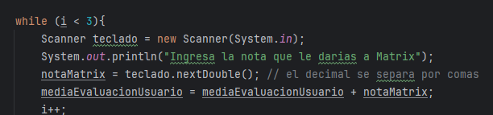

# Mi clase 01 Inmersión Java Alura
### Autor: Edwin Ramirez 

## Primeros Pasos

Para poder realizar este primer proyecto realicé lo siguiente:

<ul>
<li> Instalé el JDK (Kit de Desarrollo de Java).</li>
<li> Instalé el IntelliJ.</li>
</ul>

## Algunos Temas Que Vimos en el proyecto

Para este proyecto se estudio varios códigos que se indican a continuación:

<ul>
<li> Git Init.</li>
<li> Git hub.</li>
<li> Double: Variable del tipo flotante para guardar números en memoria que tienen parte entera y parte decimal.</li>
<li> Para declarar una variable en Java, se utiliza la siguiente sintaxis: tipo + nombreDeVariable.</li>
<li> Invocar la clase Scanner que nos permite obtener la entrada de datos primitivos. Esto quiere decir que podemos capturar datos del tipo int, double, string y etc. </li>
<li> Public class Main: Clases públicas que pueden ser reutilizadas en otras clases y que, por tanto, son accesibles desde distintas partes del código. Por defecto, siempre que una clase esté integrada dentro de un conjunto más grande, esta puede acceder a las acciones dentro del paquete, conocido como superclase.</li>
<li> Public : cada método en una clase puede ser público, protegido o privado dependiendo del nivel de acceso que el programador quiere darle. Significa que el método puede ser accedido desde cualquier otro método que tenga una instancia de esta clase.</li>
<li> Static : un método puede ser de instancia o de clase. Un método NO estático es un método de instancia (que necesita una instancia de la clase donde se declara para ser invocado) y un método estático es un método de clase (sólo se necesita invocarlo dada la clase, no un objeto de dicha clase).</li>
<li> Void : Los métodos pueden devolver algo, por ejemplo, un método que suma dos números, devuelve el resultado de la suma; pero hay métodos que no devuelven nada y que sólo ejecutan acciones. Dichos métodos se declaran con la palabra reservada.</li>
<li> La instrucción System.out.println() imprime el texto especificado dentro de los paréntesis en la pantalla.</li>
<li> For y While: El bucle for se utiliza cuando se conoce la cantidad de iteraciones de antemano, y se recorre un iterable (como una lista) elemento por elemento. El bucle while se utiliza cuando la cantidad de iteraciones depende de una condición que puede cambiar durante la ejecución, y se repite mientras se cumpla esa condición.</li>

</ul>

**Entre otros Comandos**
## Situaciones que tuvimos que resolver

Para este proyecto se estudio varios códigos que se indican a continuación:

<ul>
<li> configurar cuenta GIThub dentro de IntelliJ</li>
</ul>

## Adaptación del código con el Bucle While
 <h1>  </h1>
